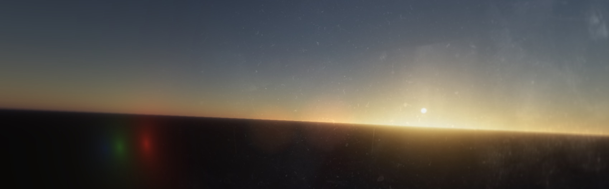

# The Sun, the Sky, and the Horizon

Experiment.

## Installation
Install all listed dependencies. Runin the project's root directory:
```bash
npm install
```

## Shader: Transmittance

```quote
Precomputes the optical depth between two points in the atmosphere.
```

Transmittance ($T$) is the result of the Beer-Lambert Law. 
To get $T$, you first have to calculate the Optical Depth (often denoted as $\tau$).
$$T = e^{-\tau}$$
* The Loop: Calculates $\tau$, the accumulation of coefficients (various absorbers) over a distance.
* The Final Line: Converts that $\tau$ into $T$ using exp().

By saying the function "Precomputes the optical depth," 
we are describing the actual heavy lifting of the integration ($result += extinction \cdot dt$).

This shader specifically calculates transmittance from a point $A$ (at altitude $r$) 
to the "top of the atmosphere" (point $B$). 
However, the math inside the loop is actually a general-purpose Line Integral.

* Why "Two Points": The algorithm integrates from ray_origin to ray_origin + ray_dir * t_max. In this specific LUT, the second point happens to be the atmosphere boundary.

* Why it matters: Later in your engine, you might want to calculate transmittance between a mountain top and a cloud, or a player and a building. Using the term "Optical Depth" reminds the team that we are measuring the "thickness" of the air between any two points in 3D space.

### Precision and Storage
In some advanced scattering implementations (like Hillaire 2020 or more recent Frostbite/UE5 papers), devs sometimes store the Optical Depth $(\tau)$ in the LUT instead of the Transmittance $(e^{-\tau})$.

* Linearity: Optical depth is linear. You can add two optical depths together: $\tau_{(A \to C)} = \tau_{(A \to B)} + \tau_{(B \to C)}$.

* Transmittance is Multiplicative: To combine transmittance, you must multiply: $T_{(A \to C)} = T_{(A \to B)} \cdot T_{(B \to C)}$.

Multiplication of small floats leads to precision loss faster than addition. While your current shader stores the final Transmittance, keeping the "Optical Depth" terminology in the comments helps future-proof the code for developers who might need to debug the raw integral values.

### Summary
* Optical Depth: The "stuff" in the air that blocks light (The result variable).

* Transmittance: The percentage of light that actually makes it through (The gl_FragColor).

## Shader: Scattering

