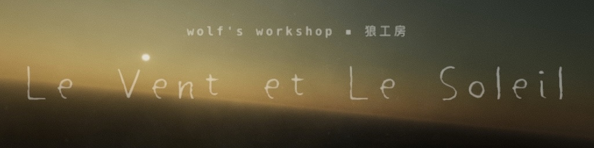
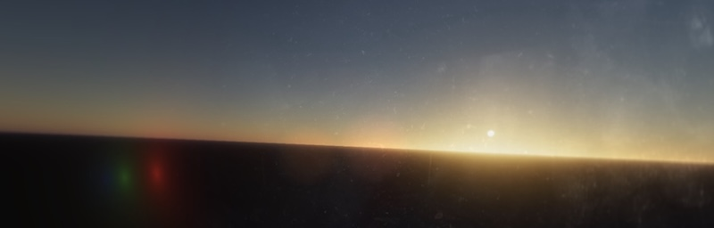
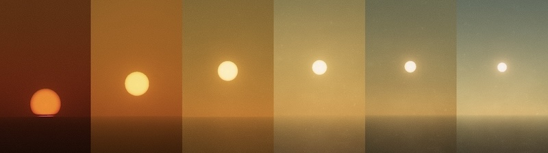
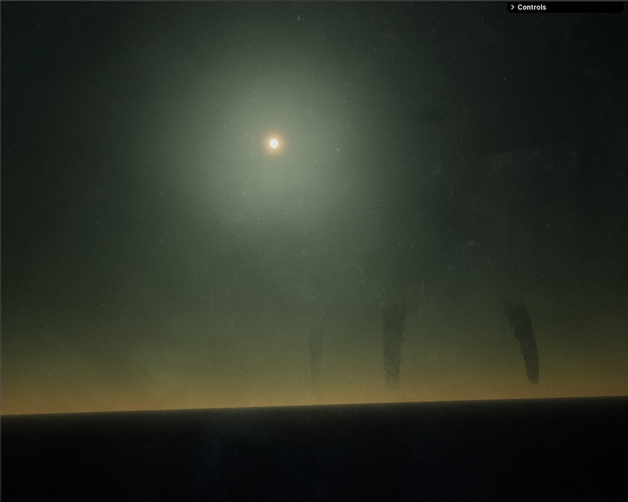

# Le Vent et le Soleil (working title)
### *A Physically-based Atmospheric Simulation Demo that is indefinitely work-in-progress*


[*Serious tone*] This is a realtime atmospheric renderer exploring physically based light transport and cinematic post-processing. This project demonstrates the integration of computational physics (Rayleigh/Mie scattering) with modern web performance engineering (GPGPU-style LUT precomputation).

<video src="./images/scrn_cap_2.mp4" controls muted style="width:50%;" poster="./images/scrn_cap_2_thumb.jpeg"></video>

Okay, this is what actually motivates me.

## The "Retour d'âge" Manifesto
They say you can't go home again, but in the scene, we just wait for the hardware to get faster.

This project is my candid "retour d'âge"—a mid-life "relapse" into the world of pure graphics. After decades in the deep end of C++ system architecture and academic R&D, I’ve taken this career pivot to reclaim my roots in the demogroup, Mode XIX and Mutante.
```
Mode XIX (1993-1996)
                            d8b                       d8,                 
                           d88                                    
  88bd8b,d88b  d8888b  d888888   d8888b    ?88,  88P  88b?88,  88P
  88P'`?8P'?8bd8P' ?88d8P' ?88  d8b_,dP     `?8bd8P'  88P `?8bd8P'
 d88  d88  88P88b  d8888b  ,88b 88b         d8P?8b,  d88  d8P?8b, 
d88' d88'  88b`?8888P'`?88P'`88b`?888P'    d8P' `?8bd88' d8P' `?8b
```

```
Mutatnte (1996-1998)
 ███▄ ▄███▓ █    ██ ▄▄▄█████▓ ▄▄▄       ███▄    █ ▄▄▄█████▓▓█████ 
▓██▒▀█▀ ██▒ ██  ▓██▒▓  ██▒ ▓▒▒████▄     ██ ▀█   █ ▓  ██▒ ▓▒▓█   ▀ 
▓██    ▓██░▓██  ▒██░▒ ▓██░ ▒░▒██  ▀█▄  ▓██  ▀█ ██▒▒ ▓██░ ▒░▒███   
▒██    ▒██ ▓▓█  ░██░░ ▓██▓ ░ ░██▄▄▄▄██ ▓██▒  ▐▌██▒░ ▓██▓ ░ ▒▓█  ▄ 
▒██▒   ░██▒▒▒█████▓   ▒██▒ ░  ▓█   ▓██▒▒██░   ▓██░  ▒██▒ ░ ░▒████▒
░ ▒░   ░  ░░▒▓▒ ▒ ▒   ▒ ░░    ▒▒   ▓▒█░░ ▒░   ▒ ▒   ▒ ░░   ░░ ▒░ ░
░  ░      ░░░▒░ ░ ░     ░      ▒   ▒▒ ░░ ░░   ░ ▒░    ░     ░ ░  ░
░      ░    ░░░ ░ ░   ░        ░   ▒      ░   ░ ░   ░         ░   
       ░      ░                    ░  ░         ░             ░  ░
```
Back in the 90s, we were coding MOV AX, 13h and fighting over 640KB of base memory. Today, the canvas is the browser, the assembly is GLSL, and the toolchain is TypeScript + Vite. This isn't just a portfolio piece; it's a stubborn veteran coder bridging the gap between old-school "hard-to-the-metal" logic and modern GPU-driven artistry.

So for this homecoming, i am currently working under the banner "wolf's workshop".



[*The lens dirt, the flare*]

## Some Technical (I will document the details elsewhere, some other time)

This engine is built on the philosophy that if you aren't fighting with the math, you aren't really coding.

- Transmittance LUTs: Precomputing optical depth into 2D textures. Because even with modern GPUs, calculating the Beer-Lambert law in a real-time raymarch loop is a waste of cycles.

- Spectral Scattering: Real-time numerical integration for Rayleigh and Mie models.

- The "Demoscene" Finish: * Blue Noise Dithering: Using 512x512 blue noise to kill the 8-bit banding artifacts that plague sky gradients.

    - Golden Angle Bokeh: Why use a simple blur when you can distribute your samples across a Fermat spiral?

    - Solar Effects: Solar limb darkening and atmospheric refraction logic that squishes the sun as it hits the horizon. And don't forget that heat-haze that makes those layers wobbles.

<br>



[*The sun and the dust*]

<br><br>
---
<br>



[*the cosmic horror*]

## Future: The Colossus & The Call of Cthulhu
The sky is just the beginning. I am currently working to "expand" the horizon.

- Procedural Behemoths: Implementation of a colossal, Lovecraftian entity walking the distance—powered by Inverse Kinematics (IK) for ground-aware limb placement and procedural vertex displacement for "pulsing" organic skin textures.

- Generative Audio: What is demoscene without sound and music? The roaring wind and creature "calls" will be synthesized (via web audio api??). Low-frequency rumbles and resonant filters that make the scene feel as massive.

## Standing on the Shoulders of Giants
While the demoscene taught me the foundations, I am learning a massive amount of new "modern tricks" from the talented wizards over at Shadertoy.

> Note: Full attributions to the specific Shadertoy authors whose techniques (Atmospheric > scattering models, Bokeh kernels, and Dithering logic) have informed this project will > be added as the engine hits its 50% milestone.


## Mode XIX // Mutante
*The silicon is different, but the code is still raw.*

## References (to be expanded)
- mode xix: https://www.pouet.net/groups.php?which=11535
- mutante: https://www.pouet.net/groups.php?which=11574
- Night Sky: https://www.youtube.com/watch?v=H6wX-ExkoYQ
- Lens Flare: https://www.youtube.com/watch?v=AQsz83SauJA
- Real-time dreamy Cloudscape: https://blog.maximeheckel.com/posts/real-time-cloudscapes-with-volumetric-raymarching/